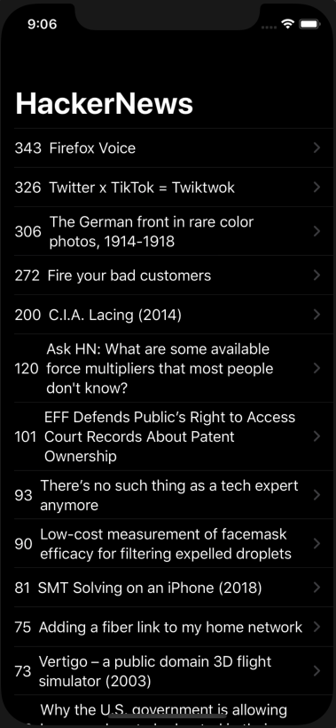

# HackerNews
> A SwiftUI app that displays the front page of Hacker News.

[![Swift Version][swift-image]][swift-url]
[![License][license-image]][license-url]

The SwiftUI app displays the front page of Hacker News to the user. Clicking on a headline navigates the user to a custom WebView to display the news post.



## Features
1. SwiftUI
2. NavigationLink
3. Web Api

## Requirements 
- iOS 13.6+
- Xcode 9.3+

## Installation
1. Download and drop ```HackerNews.swift``` in your project.  

[swift-image]:https://img.shields.io/badge/swift-5.0-orange.svg
[swift-url]: https://swift.org/
[license-image]: https://img.shields.io/badge/License-MIT-blue.svg
[license-url]: https://opensource.org/licenses/MIT
